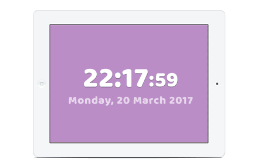

# StatusWall
[ ](https://app.codeship.com/projects/294415)

A digital wall clock & vital info dashboard app.
I'm builing this as a first React project bootstrapped with [Create React App](https://github.com/facebookincubator/create-react-app).



Below are scripts (as present in the bootstraper) to run, test and develop the app.<br>

### Available Scripts

In the project directory, you can run:

#### `npm start`

Runs the app in the development mode.<br>
Open [http://localhost:3000](http://localhost:3000) to view it in the browser.

*Important*: The app will not run without a valid `config.json`. This file contains settings such as private API keys and content, hence non-inclusion in the public repo. A sample of the file below:

```
{
    "api": {
        "weatherunderground": {
            "key": "<your weather underground key>"
        },
        "googlecalendar": {
            "clientid":"<your google api client id>",
            "clientsecret": "<your google api client secret>"
        }
    }
}
```

After successful setup, the app will automatically reload in the browser if you make edits.<br>
You will also see any lint errors in the console.

#### `npm test`

Launches the test runner in the interactive watch mode.<br>
See the section about [running tests](#running-tests) for more information.

#### `npm run build`

Builds the app for production to the `build` folder.<br>
It correctly bundles React in production mode and optimizes the build for the best performance.

The build is minified and the filenames include the hashes.<br>
Your app is ready to be deployed!


#### `npm run eject`

**Note: this is a one-way operation. Once you `eject`, you can’t go back!**

If you aren’t satisfied with the build tool and configuration choices, you can `eject` at any time. This command will remove the single build dependency from your project.

Instead, it will copy all the configuration files and the transitive dependencies (Webpack, Babel, ESLint, etc) right into your project so you have full control over them. All of the commands except `eject` will still work, but they will point to the copied scripts so you can tweak them. At this point you’re on your own.

You don’t have to ever use `eject`. The curated feature set is suitable for small and middle deployments, and you shouldn’t feel obligated to use this feature. However we understand that this tool wouldn’t be useful if you couldn’t customize it when you are ready for it.

